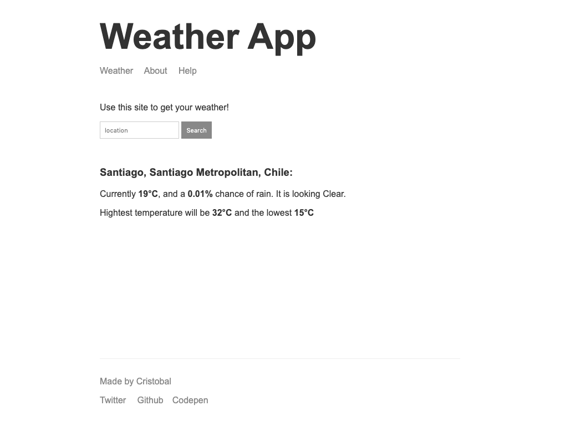

## Weather App

#### This app was developed in order to practice backend.

The app uses two different APIs (Mapbox and Darksky) to transform the name of a location to longitude-latitude coordinates, and from there, use the coordinates to get weather information.

Try the deployed version [here](http://ceheiss-node-weather-app.herokuapp.com/) 

